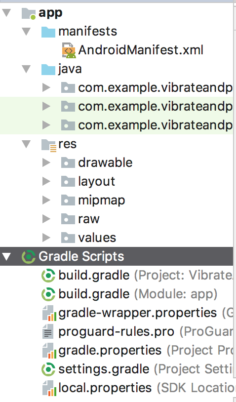
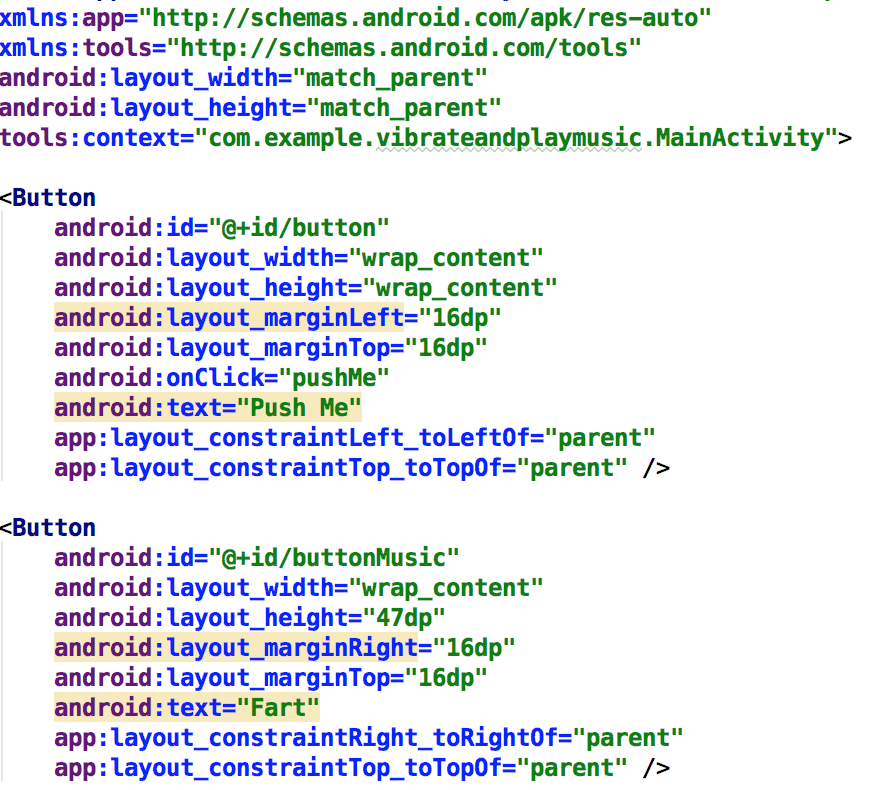
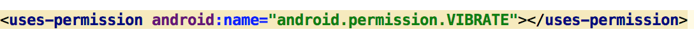
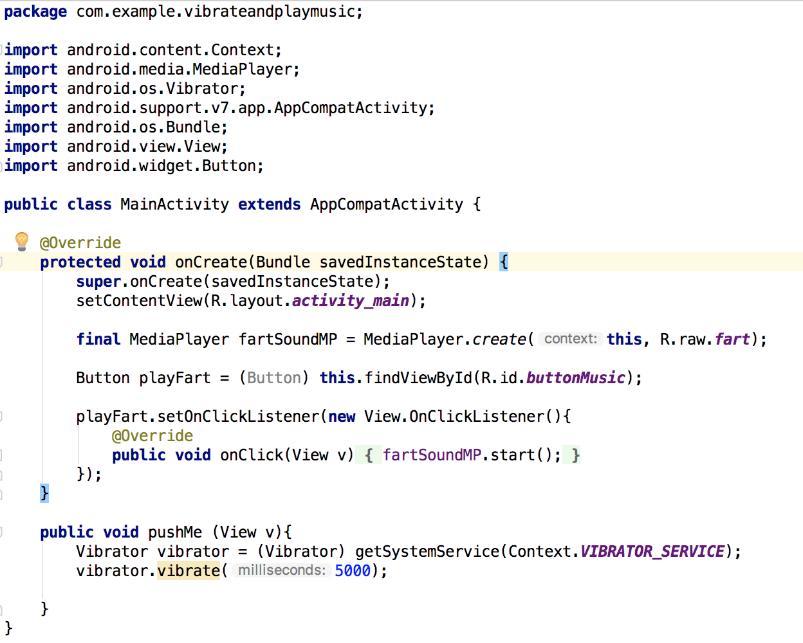

# Play music and vibration app 
## Hvad går denne app ud på?

##### Denne app er en læringsprocess, en process der giver brugeren en ide om hvordan man bruger android studio.
##### App'en har følgende funktioner:
##### 1: Spille en lyd som udvikleren selv har til opgave at finde.
##### 2: Vibrere telefonen i et antal af sekunder som udvikleren selv vælger.

##### Med denne app, vil brugeren lære at udvikle en app som har de ovenstående funktioner,
##### og samtidig få et indblik i android studio.

##### For at udvikle appen skal man starte med at finde en lydfil man gerne vil have app'en skal kunne spille.

##### Start med at lave et ganske almindeligt Android projekt.
##### projektet vil automatisk lave 2 mapper den ene kaldet app og den anden Gradle Scripts. inde i app mappen finder du 3 nye mapper manifests, java og res mappen.

##### Da der er alt for mange mapper, som bliver auto genereret har jeg valgt at ligge et billede op. Projektet skulle meget gerne se således ud.

##### Hav lydfilen klar, og start så ved at gå ind i mappen hvor projektet ligger. i dette tilfælde ligger min mappe på skrivebordet herefter går du ind på -> app -> src -> main -> res -> raw og hiver lydfilen ind. Dette vil resultere i at du inde i android studio kan se din lydfil inde i app -> res -> raw lydfilen skal hede .mp3 min fil hedder foreksempel fart.mp3. Gå derefter ind på String.xml filen og skift navnet på filen, så den kan hedde hvad man ønsker når appen bliver kørt på en telefon. Derefter skal man gå ind på activity_main.xml trykke på design nede i bunden og dragge 2 knapper ind. gå derefter ind på text som er nedert ved siden af design knappen.

##### Sådan bør det se ud når det er færdigt, her inde kan man justere knapperne så de ligger i den rigtige position man kan give dem deres id android:id="@+id/button" således og vælge hvor meget mellemrum der skal være mellem vægene og knapperne således android:layout_marginLeft="16dp"
##### android:layout_marginTop="16dp"
##### top og left indikere hvilken side afstanden skal tages fra. teksten som skal stå inde i knappen vælges således android:text="Push Me". På billedet ses 2 knapper den øverste gør at telefonen kan vibrere og den nederste at den kan spille en lyd.

##### inde i AndroidManifest.xml er det yderst vigtigt, at denne linje bliver tilføjet oven over <application. denne linje gør at vi tillader telefonen adgang til at bruge vibrations mekanismen.

##### Næste skridt er at gå ind i MainActivity.java her inde skal vi skrive koden, til at få appen til at udføre de funktioner vi vil ha den til. Øverst ser vi package navnet og imports. når appen er færdig skal alle disse imports være til at finde på skærmen. derefter kommer klassen. den første metode i klassen er den der får appen til at kunne spille en lyd. vi starter med at finde knappen ved hjælp af dens id. derefter laver vi en OnClickListener som "lytter" til om knappen bliver trykket på. derefter sætter vi knappen til at afspille lyden ved at sige. 
##### public void onClick(View v)
##### {
##### fartSoundMP.start();
##### }

##### Metoden nedenunder som hedder pushMe er den som gør at telefonen kan vibrere. Metoden er yderst simpel vi tillader den adgang til at kunne vibrere på den første linje, og på linje nr 2 ber vi den om at vibrere. på billedet ses (milliseconds: 5000); man skal ikke lade sig snyde, skriv blot det antal millisekunder man ønsker at telefonen skal vibrere og den grålige tekst vil selv poppe op. i dette tilfælde har vi valgt 5000 millisekunder da det er svarende til 5 sekunder man vælger antalet af sekunder efter eget behøv.

# Evaluering - Hvordan gik det?
##### Forløbet gik ret godt, da opgaven ikke var særlig svær kan man ikke sige at jeg havde store problemer, med at få den løst. opgaven var ligetil og faktisk ret sjov at eksperimentere med når man var kommet igang.

# Konklusion
##### Har man svært ved at komme igang med android og synes man det er lidt svært, så vil jeg råde til at man laver små opgaver som denne. det bringer smilet frem på læben når man laver noget som virker og det giver forståelse for diverse ting inden for android som ikke er komplekse.

opgaven ser ret hæslig ud, men bær over med mig, det er første gang jeg laver noget i sådan en fil her. :)
